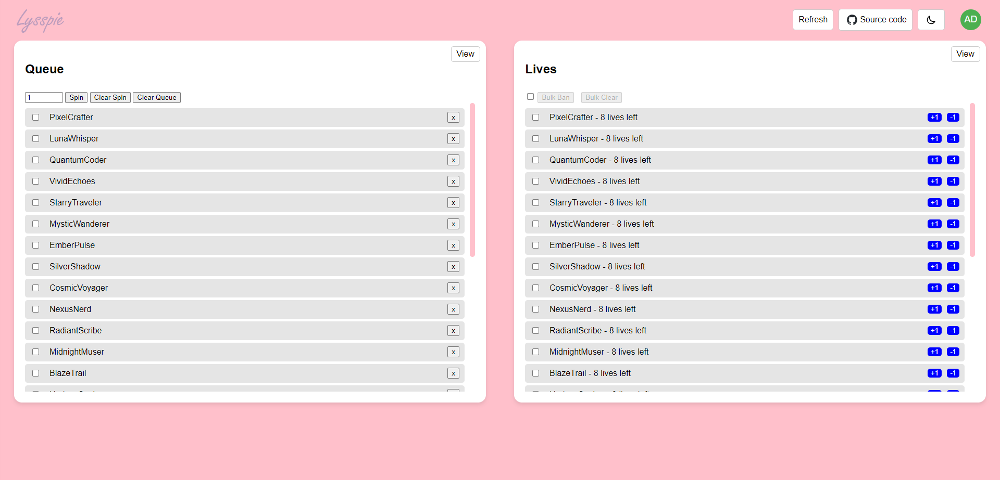

<h1 align="center"> LysspieAPI </h1> 

<p align="center">
  
</p>

<p align="center">
  
</p>

LysspieAPI is a powerful backend designed to integrate with [Nightbot](https://nightbot.tv/), enabling seamless management of Twitch chat interactions, queue management, and live moderation. This web interface serves as the control center for handling queues, managing lives, selecting winners, and executing commands directly in Twitch chat.

Made with love for [Lysspie](https://www.twitch.tv/lysspie) <3

### Overview
LysspieAPI is built to work in tandem with Nightbot, a popular Twitch bot that allows users to interact with the chat through commands. This API extends Nightbot's functionality, providing moderators with advanced tools to manage chat activities, including:

- **Queue Management**: Organize and manage queues efficiently during live streams. This feature is particularly useful for streamers who engage with their audience through games or giveaways.

- **Chat Moderation:** Manage the flow of chat by banning or clearing disruptive users directly from the web interface. Moderators can trigger these actions via chat commands or through the web interface.

- **Winner Selection:** Easily select winners for giveaways or other events using the spin feature, which can be executed from the web interface or triggered by chat commands.

- **Integration with Nightbot's API:** LysspieAPI communicates with Nightbot's API to handle commands, manage chat interactions, and keep everything synchronized.

### Key Features
- **Web-Based Queue Management:** A user-friendly interface that allows moderators to manage queues during live streams. The interface provides options to spin, clear, or reorder the queue.

- **Live Moderation:** Instantly ban users or clear lives in the chat with just a few clicks. The moderation tools are designed to keep the chat clean and engaging.

- **Seamless Integration with Nightbot:** The LysspieAPI is designed to work closely with Nightbot, ensuring that all commands and interactions in the Twitch chat are handled smoothly.

- **Spin and Winner Selection:** A feature to randomly select winners during events or giveaways. This can be done directly through the web interface or via chat commands.

### API Endpoints
#### Authentication
- `/api/login`: Authenticates the user and provides a token for accessing protected routes.

#### Queue Management
- `/api/get_queue`: Retrieves the current queue.
- `/api/add_to_queue`: Adds a user to the queue.
- `/api/remove_from_queue`: Removes a user from the queue.
- `/api/clear_queue`: Clears the entire queue.

#### Live Moderation
- `/api/ban_user`: Bans a user from the chat.
- `/api/unban_user`: Unbans a previously banned user.
- `/api/clear_lives`: Clears lives from specific users.

#### Spin and Winner Selection
- `/api/spin_queue`: Spins the queue to select a random winner.
- `/api/get_winner`: Retrieves the winner from the last spin

### Installation

1. **Clone the repository:**

    ```bash
    git clone https://github.com/your-username/LysspieAPI.git
    cd LysspieAPI
    ```

2. **Install the necessary dependencies:**

    ```bash
    pip install -r requirements.txt
    ```

3. **Obtain Nightbot configuration information:**<br>
    When you connect Nightbot to the LysspieAPI, Nightbot sends some information to help manage your Twitch chat effectively. This information is automatically sent to LysspieAPI whenever certain actions are performed. Here's what you need to know:

    - **Nightbot User Information**<br>
    Nightbot sends information about the user who triggered the command in your Twitch chat. This helps LysspieAPI identify who is interacting with the system.

        ```bash
        NIGHTBOT_USER=name=twitchUsername&displayName=twitchUsername&provider=twitch&providerId=123456789&userLevel=owner
        ```

    - **Nightbot Channel Information**<br>
    Nightbot also sends information about the Twitch channel where the command was triggered.
    
        ```bash
        NIGHTBOT_USER=name=twitchUsername&displayName=twitchUsername&provider=twitch&providerId=123456789

    - **How to Obtain Your Twitch ID:**<br>
     To set up Nightbot integration, you will need your Twitch ID, which is a unique identifier for your Twitch account. You can obtain your Twitch ID using a tool like Streamscharts Twitch Username to ID Converter or similar tools.

        1. Visit the [Streamscharts Twitch Username to ID Converter](https://streamscharts.com/tools/convert-username).
        2. Enter your Twitch username in the provided field.
        3. Copy the generated Twitch ID.

4. **Set up your `.env` file with the following variables:**

    ```env
    DEBUG=True
    PRODUCTION=False
    DATABASE=POSTGRES  # or MYSQL
    POSTGRES_DEV_URI=your_postgres_dev_uri
    POSTGRES_PROD_URI=your_postgres_prod_uri
    MYSQL_DEV_URI=your_mysql_dev_uri
    MYSQL_PROD_URI=your_mysql_prod_uri
    APP_DEFAULT_USERNAME=example@example.com
    APP_DEFAULT_PASSWORD=<your_secure_password>
    SECRET_KEY=your_secret_key
    NIGHTBOT_USER=user_from_step_3
    NIGHTBOT_CHANNEL=channel_from_step_3
    ```

5. **Run the application:**

    ```bash
    python app.py
    ```

### Security

Security is a top priority for LysspieAPI, and several measures have been implemented to ensure the protection of user data and interactions. While this section provides a high-level overview, more detailed security specifications will be outlined in a forthcoming SPEC file.

#### Key Security Features
- **Authentication:** LysspieAPI uses JWT tokens for authentication. Tokens are issued upon successful login and are required for accessing protected routes. Tokens are configured to expire after a specified time, enhancing security by limiting token validity.

- **Token Expiry and Revocation:** JWT tokens are configured to expire after a defined period. Users are automatically logged out upon token expiration. Token revocation mechanisms are in place to invalidate tokens in case of suspicious activity.

- **Rate Limiting:** To protect against brute force attacks, rate limiting is applied across the API. Repeated failed login attempts or excessive requests from a single IP address can trigger temporary bans.

- **Sensitive Data Handling:** All sensitive data, including user credentials and API keys, are securely hashed and encrypted. Environmental variables, such as the SECRET_KEY, are used to enhance data protection.

- **Logging and Monitoring:** LysspieAPI includes comprehensive logging mechanisms to monitor access, errors, and potential security breaches. Logs are segmented into different types (e.g., access logs, error logs) to facilitate easier monitoring and troubleshooting.

#### Upcoming Security Enhancements
- **Detailed Security SPEC File:** A comprehensive security specification (SPEC) file will be provided, detailing the security protocols, encryption methods, and additional protective measures implemented in LysspieAPI.

- **Advanced User Permissions:** Future updates will include more granular user permission settings, allowing for tighter control over who can access specific features and functionalities.

For more detailed information, please refer to the upcoming security SPEC file.

### Contribution

Feel free to submit issues and enhancement requests.
